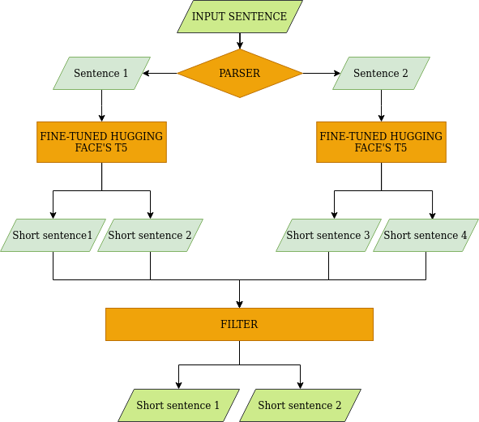
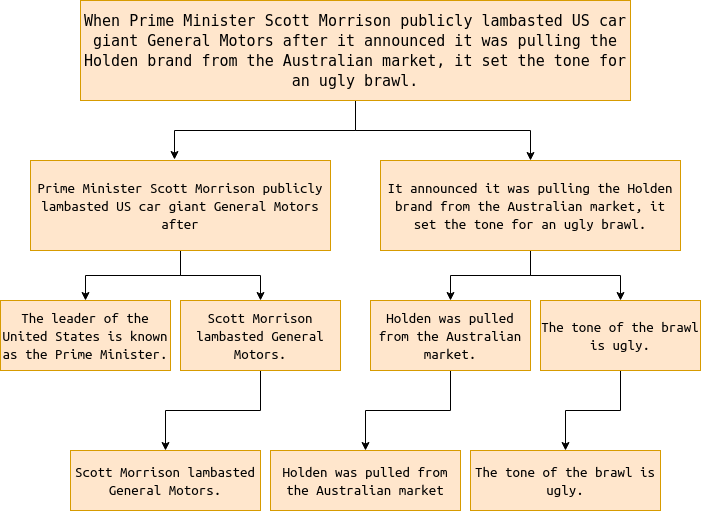

# Split-and-Rephrase

## Overview

Sentence simplification where the aim is to split a complex sentence into a meaning preserving sequence of shorter sentences. 

The input sentence with more than two clauses are strategically broken into 2 sentences, each sentence having no more than 2 clauses. They are sent to the **Hugging Face's T5** pre-trained model fine-tuned with 300K sentences from websplit v1.0 dataset, to split up into multiple sentences. Each multiple sentences is further assigned a similarity score to the input sentence based on **TF-IDF Vectorizer**. The sentences with fewer similarity scores are removed.

The link to the models and data can be found [here](https://drive.google.com/drive/folders/1RmVMuqlxBKkgmbRU5ww1E_LRibFcdtqt?usp=sharing), and link to the jars can be found [here](https://drive.google.com/drive/folders/1g8GDCR-sXCLWHon11Sa_7p3Le4lQESCT?usp=sharing).

## Example

## Future Works

- Preservation of keywords is an important factor. But the output from the fine-tuned Hugging Face's T5 model replaced few words with their synonyms. This can be improved by filtering the training data from the dataset.
- Loss of important keywords. The output sometimes ignores important dates, places, etc.

## Credits

- **rui-yan**: [split-and-rephrase](https://github.com/rui-yan/split-and-rephrase)
- **shreyaUp**: [Sentence-Simplification](https://github.com/shreyaUp/Sentence-Simplification)

